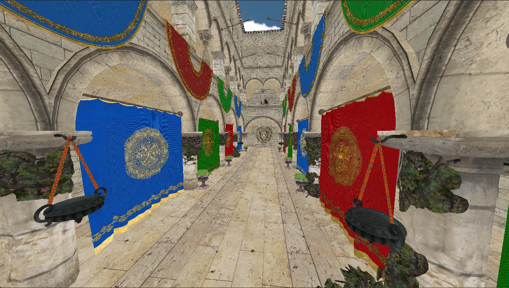

# Pathtracer : DXR pathtracer using the Oslo framework

This project is a DXR powered pathtracer using my [Oslo](https://github.com/AmelieHeinrich/Oslo) framework.
It's goal is to provide me with the resources to learn everything about light transport, raytracing on the GPU, denoising etc.

## Screenshots

Screenshot as of April 7th 2025:

