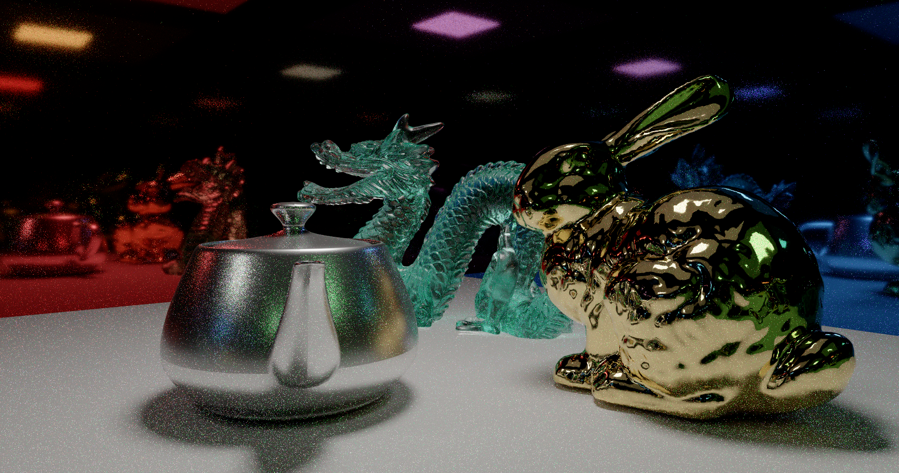
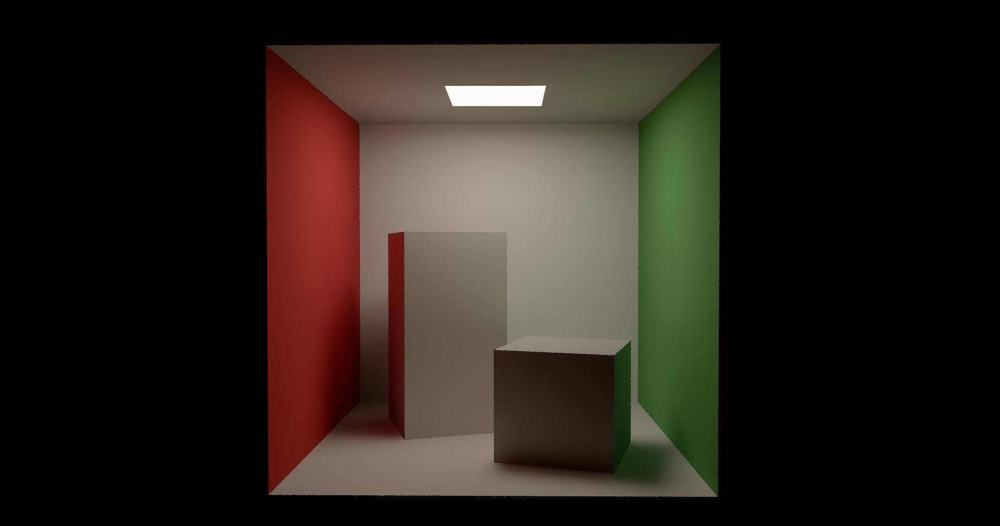
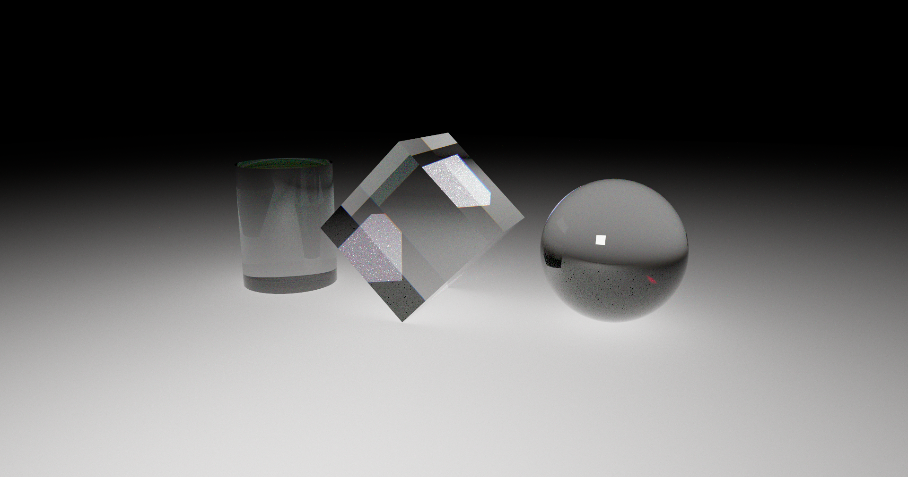
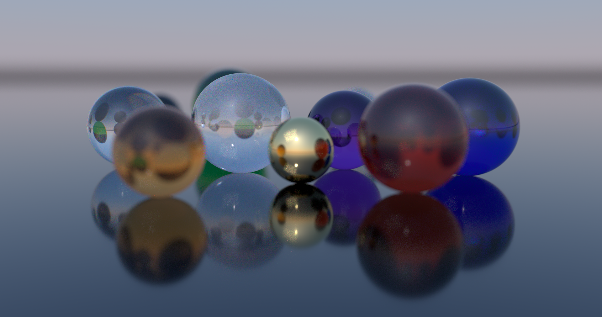
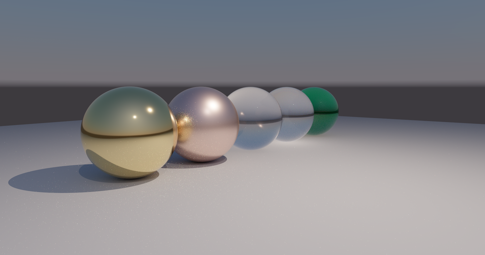

# Pathtracer

A spectral path tracer built on `VK_KHR_ray_tracing_pipeline`, with a scene editor attached.
Vulkan 1.4, C11, Linux.



Light is transported as spectra rather than as RGB triples. Every path carries four wavelengths
drawn together, materials are upsampled from authored colours into reflectance spectra, and the
whole thing is resolved to a colour exactly once, at the end of the path. That is what buys
dispersion through glass, wavelength-dependent absorption, and metals that tint their own
reflections.

## Features

**Integrator**
- Iterative path tracing in the raygen shader — hit shaders only describe the surface they
  landed on, so `maxPipelineRayRecursionDepth` stays at 1.
- Next event estimation with shadow rays, and multiple importance sampling between explicit sun
  sampling and BSDF sampling.
- Russian roulette once a path is long enough to justify it.
- Progressive accumulation, restarted automatically whenever the camera or a render setting
  changes.

**Spectral rendering**
- Four hero wavelengths per path, stratified across the visible band.
- Jakob–Hanika reflectance upsampling, so an authored albedo becomes a physically plausible
  spectrum rather than three numbers.
- Cauchy dispersion from an index and an Abbe number. A dispersive refraction collapses the
  path to its hero wavelength, which is what makes the estimator stay correct.
- Beer–Lambert absorption through transmissive media, per wavelength — so thick coloured glass
  shifts hue rather than merely darkening.
- Preetham sky with a Planck-spectrum sun disc at its true 0.53° angular diameter.

**Materials**
- GGX microfacet specular over a Lambertian base, sampled by visible normals.
- Rough dielectrics with real Fresnel and total internal reflection, not a Schlick
  approximation — TIR is most of what makes glass look like glass.
- Metallic, roughness, transmission, IOR, Abbe number, emission and per-unit attenuation.

**Geometry and lights**
- Triangle meshes, plus analytic spheres, cylinders and cones through intersection shaders.
- Point, directional, spot and area lights, with optional blackbody colour temperature.

**Camera and post-processing**
- Thin-lens depth of field with aperture and focus distance, authored per scene.
- À-trous wavelet denoiser (Dammertz et al.) with luminance, normal and depth edge stopping.
- Tonemapping — AgX, ACES or Reinhard — with an exposure control.
- Blue-noise sampling over the low-dimensional prefix (hero wavelength, pixel jitter, lens),
  using a per-pixel offset into a low-discrepancy sequence.

**Editor**
- Translate, rotate and scale gizmos; click-to-select picking that runs through the very same
  intersection shaders the image does, so it can never disagree with what is on screen.
- A nuklear overlay for every render setting and material property.
- Plain-text `.pts` scene files that load and save round-trip.
- Shader hot reload on <kbd>R</kbd>.

## Gallery

| | |
|---|---|
|  |  |
| The Cornell box, lit by a single area light. | Coloured glass with per-wavelength absorption. |
|  |  |
| Baked meshes under the Preetham sky. | Conductors and dielectrics side by side. |

## Building

Requires a GPU and driver with ray tracing support, and `python3` for the asset bake.

```
xmake
xmake run Pathtracer
```

Everything else is fetched by xmake: slang (used only as a build-time tool — `slangc` is
spawned as a process, and no Slang library is linked), volk, GLFW, nuklear, stb and cgltf.

Three things are generated rather than committed, and all of `assets/` is gitignored:

- **Meshes.** `tools/bake_assets.py` converts `assets/source/*.obj` into a flat format the
  renderer can `fread` straight into a buffer — which is why there is no OBJ or glTF parser
  anywhere in `src/`. It runs automatically and is a no-op once warm.
- **Spectral tables.** `tools/bake_spectral.py` computes the colour matching functions, the
  daylight basis and the Jakob–Hanika fit. A cold bake takes several minutes; after that it is
  silent.
- **Blue noise.** Christoph Peters' free blue noise textures, expected at
  `assets/128_128/LDR_RGBA_{0,1}.png`. If they are missing the renderer falls back to white
  noise, says so once, and carries on — so this is optional. Note that fetching them from a Git
  LFS repository without running `git lfs pull` leaves pointer stubs rather than images.

## Controls

| | |
|---|---|
| `WASD` / `QE` | Fly |
| Right mouse | Look |
| Wheel | Movement speed |
| `1` `2` `3` | Translate / rotate / scale gizmo |
| `R` | Reload shaders |
| `F12` | Write `screenshot_NNNN.png`, overlay excluded |

## Command line

The command line exists mainly for `--capture`: comparing two builds means rendering the same
scene from the same viewpoint to the *same* sample count and diffing the results, which is not
something a human with a screenshot key can do repeatably.

```
Pathtracer [--scene FILE] [--sky N] [--unlit] [--denoise]
           [--tonemap none|agx|aces|reinhard] [--exposure STOPS]
           [--turbidity N] [--sun-elevation DEG]
           [--capture OUT.png|OUT.pfm [--samples N]]
```

`--capture` writes a PNG or a PFM and exits. The PFM is the one to diff: linear, full float,
unclamped, and deliberately taken *before* the tonemapper so it stays scene-referred whatever
the display settings are. `tools/compare_images.py` reports RMSE and where two captures differ.

## Scenes

| File | What it is for |
|---|---|
| `models.pts` | Baked meshes under the sky. The default. |
| `cornell.pts` | The Cornell box. Run with `--sky 0`. |
| `materials.pts` | What metallic, transmission and roughness each do, side by side. |
| `dragon.pts` | A 2.3M triangle mesh — the heavy one. |
| `furnace.pts` | The white furnace test — probes of albedo 1 inside a uniform emitter must vanish against the background. Run with `--sky 0`. |
