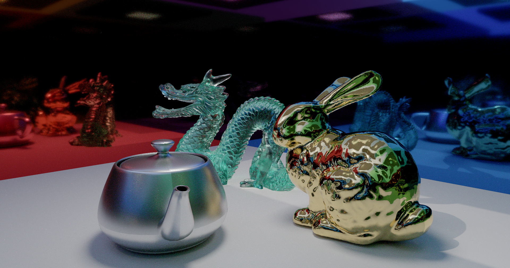
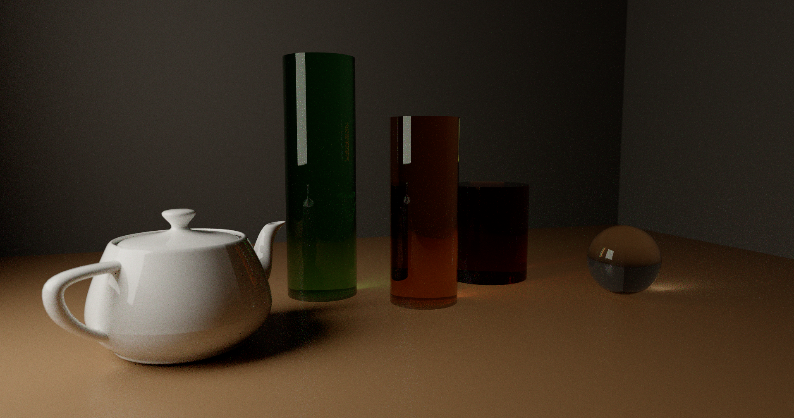
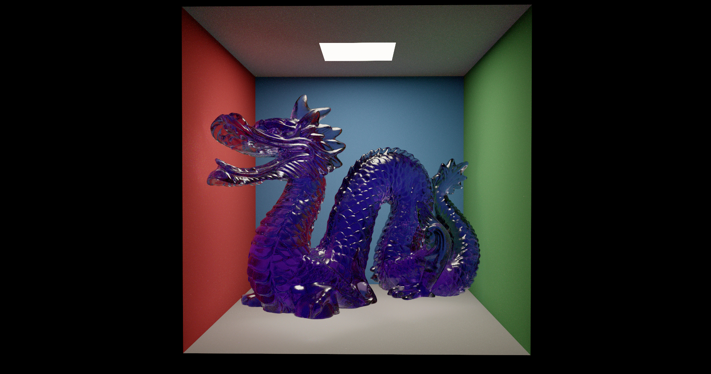
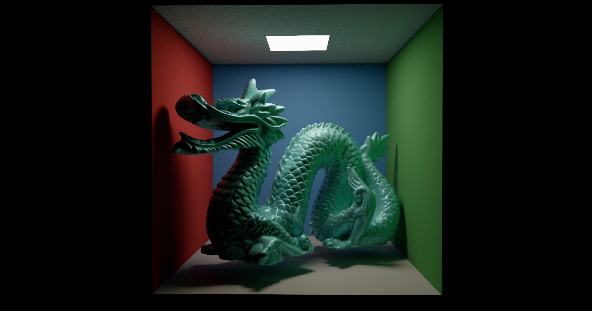
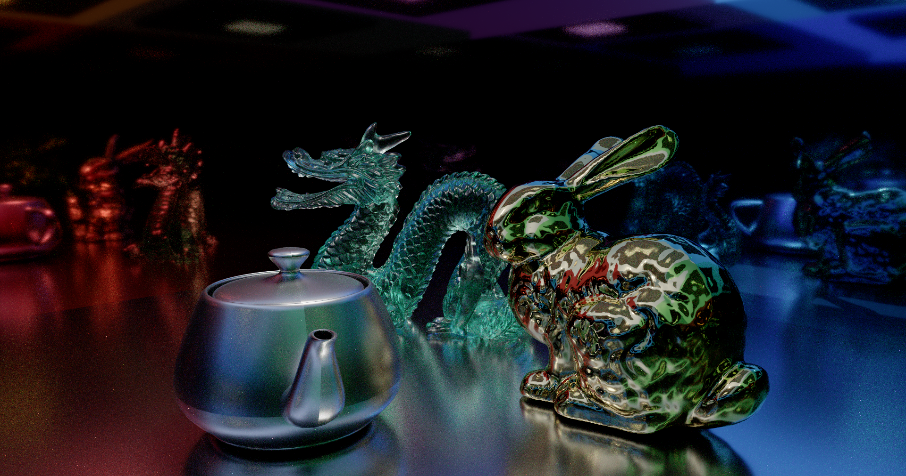
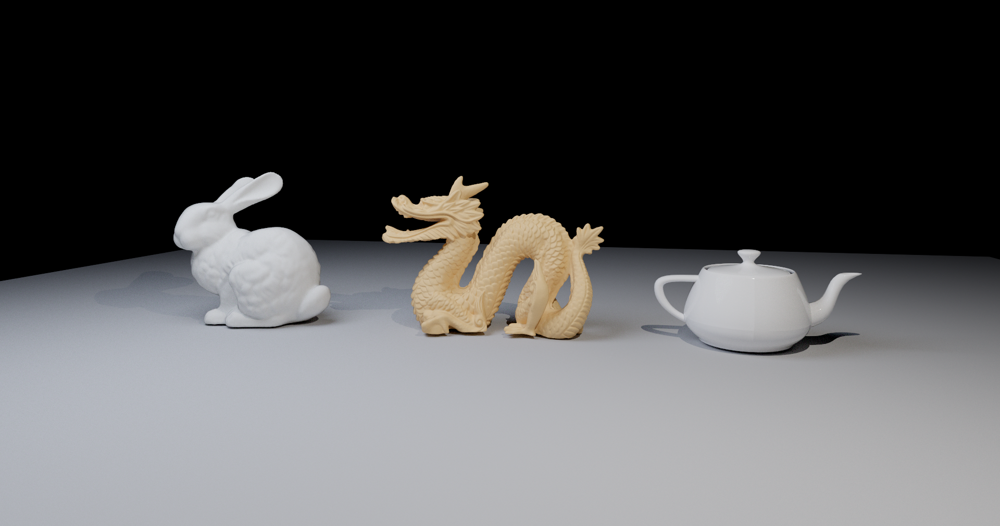

# Pathtracer

A spectral path tracer built on `VK_KHR_ray_tracing_pipeline`, with a scene editor attached.
Vulkan 1.4, C11, Linux.



Light is transported as spectra rather than as RGB triples. Every path carries four wavelengths
drawn together, materials are upsampled from authored colours into reflectance spectra, and the
whole thing is resolved to a colour exactly once, at the end of the path. That is what buys
dispersion through glass, wavelength-dependent absorption, and metals that tint their own
reflections.

## Features

**Integrator**
- Iterative path tracing in the raygen shader — hit shaders only describe the surface they
  landed on, so `maxPipelineRayRecursionDepth` stays at 1.
- Next event estimation with shadow rays, for explicit lights, for the sun disc, and for
  emissive geometry, with multiple importance sampling against BSDF sampling wherever both
  strategies can reach the same light.
- Russian roulette once a path is long enough to justify it, and never while it is still inside
  a chain of specular bounces — those are the paths that carry a caustic.
- Progressive accumulation, restarted automatically whenever the camera or a render setting
  changes.

**Convergence**
- Progressive firefly clamping: a single sample is held to a multiple of what the pixel already
  looks like, and the bound widens with the sample count. A fixed clamp permanently eats the
  energy a caustic is made of; this one admits every finite value eventually, so the estimator
  stays consistent and only early frames are biased.
- Adaptive sampling from a per-pixel variance estimate — settled pixels stand down and the
  budget goes where the noise is. Purely temporal: nothing here ever reads a neighbouring pixel,
  which is what separates it from the denoiser.
- Blue-noise sampling over the low-dimensional prefix — hero wavelength, pixel jitter, lens, and
  the first bounce's BSDF sample — using a per-pixel offset into a low-discrepancy sequence.

**Spectral rendering**
- Four hero wavelengths per path, stratified across the visible band.
- Jakob–Hanika reflectance upsampling, so an authored albedo becomes a physically plausible
  spectrum rather than three numbers.
- Cauchy dispersion from an index and an Abbe number. A dispersive refraction collapses the
  path to its hero wavelength, which is what makes the estimator stay correct.
- Beer–Lambert absorption through transmissive media, per wavelength — so thick coloured glass
  shifts hue rather than merely darkening.
- Preetham sky with a Planck-spectrum sun disc at its true 0.53° angular diameter.

**Materials**
- GGX microfacet specular over a Lambertian base, sampled by visible normals.
- Rough dielectrics with real Fresnel and total internal reflection, not a Schlick
  approximation — TIR is most of what makes glass look like glass.
- Metallic, roughness, transmission, IOR, Abbe number, emission and per-unit attenuation.

**Geometry and lights**
- Triangle meshes, plus analytic spheres, cylinders and cones through intersection shaders.
- Point, directional, spot and area lights, with optional blackbody colour temperature.
- Emissive geometry, which unlike the lights above is real geometry a bounce ray can land on.
  Flat-faced emitters — `plane` and `cube` — are also sampled explicitly, which is what makes a
  scene lit by nothing but a glowing slab converge at a sensible rate.

**Camera and post-processing**
- Thin-lens depth of field with aperture and focus distance, authored per scene.
- À-trous wavelet denoiser (Dammertz et al.) with luminance, normal and depth edge stopping.
- Tonemapping — AgX, ACES or Reinhard — with an exposure control.

**Editor**
- Translate, rotate and scale gizmos; click-to-select picking that runs through the very same
  intersection shaders the image does, so it can never disagree with what is on screen.
- A nuklear overlay for every render setting and material property.
- Plain-text `.pts` scene files that load and save round-trip.
- Shader hot reload on <kbd>R</kbd>.

## Gallery

| | |
|---|---|
|  |  |
| A 2.3M triangle mesh in dispersive glass. The tint deepens through the thick of the body and thins out at the horns — absorption, not a surface colour. | Absorption at small scale, on a polished conductor, with the thin lens wide enough to throw the near and far ranks out of focus. |
|  |  |
| Bottle glass raked by a single emissive slab. Each piece throws its own colour, because the tint is what happens to light crossing it. | Dense flint and crown glass side by side. The colour along the edges is the Abbe number, and nothing else. |
|  |  |
| The same mesh as transmissive glass, picking up the walls around it. | And opaque, for comparison — the box and the light are unchanged. |
|  |  |
| Baked meshes under the Preetham sky, with clear spheres acting as lenses. | The banner scene again, Cornell box as mirrors and ground slightly rough. |

## Building

Requires a GPU and driver with ray tracing support, and `python3` for the asset bake.

```
xmake
xmake run Pathtracer
```

Everything else is fetched by xmake: slang (used only as a build-time tool — `slangc` is
spawned as a process, and no Slang library is linked), volk, GLFW, nuklear, stb and cgltf.



Three things are generated rather than committed, and all of `assets/` is gitignored:

- **Meshes.** `tools/bake_assets.py` converts `assets/source/*.obj` into a flat format the
  renderer can `fread` straight into a buffer — which is why there is no OBJ or glTF parser
  anywhere in `src/`. It runs automatically and is a no-op once warm. Every baked mesh is
  centred and scaled into the same `[-1,1]` box the analytic shapes live in, and registers
  itself as another *shape*, so `shape dragon` is parsed and instanced by exactly the code that
  handles `shape cube`.
- **Spectral tables.** `tools/bake_spectral.py` computes the colour matching functions, the
  daylight basis and the Jakob–Hanika fit. A cold bake takes several minutes; after that it is
  silent.
- **Blue noise.** Christoph Peters' free blue noise textures, expected at
  `assets/128_128/LDR_RGBA_{0,1}.png`. If they are missing the renderer falls back to white
  noise, says so once, and carries on — so this is optional. Note that fetching them from a Git
  LFS repository without running `git lfs pull` leaves pointer stubs rather than images.

## Controls

| | |
|---|---|
| `WASD` / `QE` | Fly |
| Right mouse | Look |
| Wheel | Movement speed |
| `1` `2` `3` | Translate / rotate / scale gizmo |
| `R` | Reload shaders |
| `F12` | Write `screenshot_NNNN.png`, overlay excluded |

## Command line

The command line exists mainly for `--capture`: comparing two builds means rendering the same
scene from the same viewpoint to the *same* sample count and diffing the results, which is not
something a human with a screenshot key can do repeatably.

```
Pathtracer [--scene FILE] [--sky N] [--unlit] [--denoise]
           [--tonemap none|agx|aces|reinhard] [--exposure STOPS]
           [--turbidity N] [--sun-elevation DEG] [--bounces N]
           [--no-clamp] [--no-adaptive]
           [--capture OUT.png|OUT.pfm [--samples N]]
```

`--capture` writes a PNG or a PFM and exits. The PFM is the one to diff: linear, full float,
unclamped, and deliberately taken *before* the tonemapper so it stays scene-referred whatever
the display settings are. `tools/compare_images.py` reports RMSE and where two captures differ.

`--no-clamp` and `--no-adaptive` turn off the two variance reducers. Both are on by default and
neither changes what the image converges to, but `--no-adaptive` is worth reaching for when a
capture has to be reproducible sample for sample: with it on, `--samples` is a per-pixel budget
rather than an exact count, because a pixel that has settled stops drawing from it.

An unrecognised argument is an error rather than a warning. The failure it guards against — a
comparison script quietly capturing under the wrong settings, and the diff being read as a real
change — is much worse than an early exit.

## Scenes

`scenes/MATERIALS.txt` is the material reference: every parameter, what it does, and a block of
tested values for each common material to paste into a scene.

| File | What it is for |
|---|---|
| `models.pts` | Baked meshes under the sky. The default. |
| `default.pts` | Every analytic shape, one of each. |
| `materials.pts` | What metallic, transmission and roughness each do, side by side. |
| `material_models.pts` | The same parameters on real meshes rather than spheres. |
| `cornell.pts` | The Cornell box. Run with `--sky 0`. |
| `dragon.pts` | A 2.3M triangle mesh — the heavy one. |
| `furnace.pts` | The white furnace test — probes of albedo 1 inside a uniform emitter must vanish against the background. Run with `--sky 0`. |
| `gemstones.pts` | Depth of field, and absorption tuned to small objects. |
| `glass_dragon.pts` | One mesh in dispersive glass, backlit by an emissive slab. |
| `prism.pts` | Dense flint against crown glass — the Abbe number on its own. |
| `still_life.pts` | Coloured bottle glass under a single raking window. |
| `golden_hour.pts` | Outdoors into a low sun, with no lights at all — sun and sky are the whole rig. |

Each of the last five carries its intended command line in a header comment, since sky
intensity, bounce budget and sample count are render settings rather than scene data.
